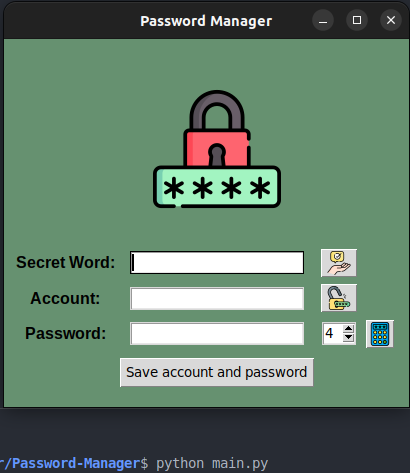

# :lock: Password-Manager
This is a simple password manager written in Python using the Tkinter GUI toolkit and PostgreSQL database.
Inspired by @angelabauer and her great [course](https://www.udemy.com/course/100-days-of-code/).

## :mage: Features
- Save account usernames and passwords securely
- Generate strong passwords
- Store a secret word for accessing the account information
- Display hints for the secret word

## :technologist: Installation
- Clone the repository
- Change to the project directory
- Install required modules: pip install -r requirements.txt
- Install PostgreSQL database for your OS https://www.postgresql.org/download/
- Install PgAdmin4 https://www.pgadmin.org/download/, create a Server 
- Configure config.py file with your own data

## :hammer: Usage
To start the Password Manager, run `python main.py` in your terminal.

## :toolbox: Contributing
Contributions are welcome! Please feel free to submit a pull request or open an issueif you encounter a bug or have a suggestion for an improvement.

## Contact
If you have any questions, comments, or suggestions, please feel free to contact me at oleksandrr1996@protonmail.com

## License
This project is licensed under the [MIT License](/LICENSE)
